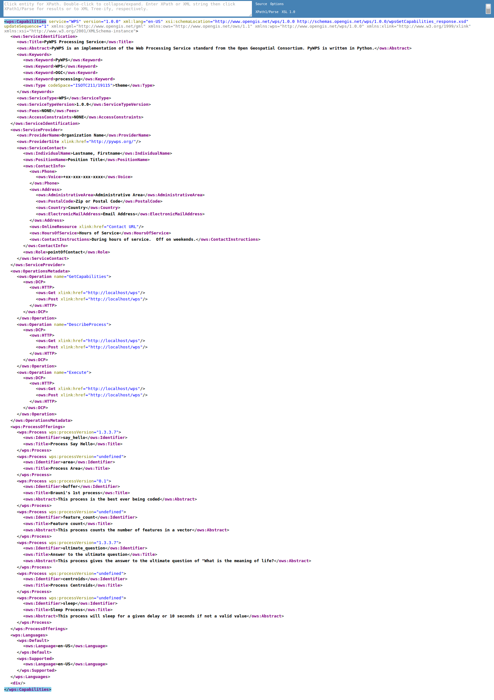
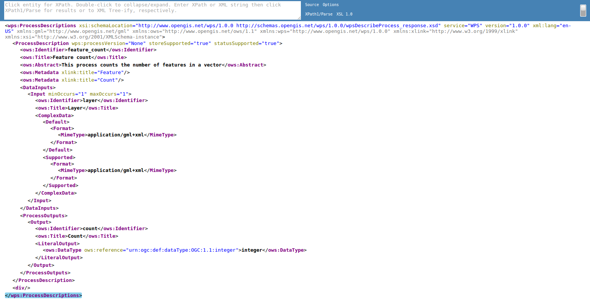
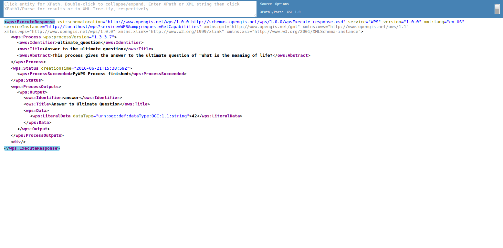
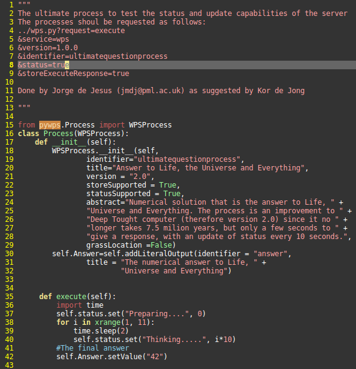
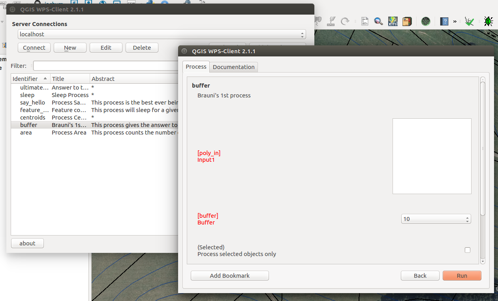

:Author: OSGeo-Live
:Author: Jachym Cepicky, Tom Kralidis
:Reviewer: Cameron Shorter
:Version: osgeo-live10.0
:License: Creative Commons Attribution

.. Cameron Comment:
  Please address Review Comments (like this one), then remove the comments.
  I've made minor syntax changes without use of comments, so it is worth
  diffing with previous changes to see what I've changed and verify it is ok.

.. Cameron Comment:
  Please have a look at the Writing Tips in the uDig Quickstart (which is 
  our sample quickstart to follow).

.. Cameron Comment:
  The screen shots at scale 25% are unreadable. We recommend 50% scale for
  1024x768 screen shots, although if you keep screen shot small, you might
  find they are easier to read, (and still fit) if you keep at 70%.

.. Cameron Comment:
  I've changed logo scale to 100%

.. Cameron Comment:
  Incubation logo is not included in Quickstarts (just Project Overviews)
  .. image:: ../../images/logos/OSGeo_incubation.png
  :scale: 100
  :alt: OSGeo Project in Incubation
  :align: right
  :target: http://www.osgeo.org

****************
PyWPS Quickstart
****************

PyWPS is an OGC WPS (Web Processing Service 1.0.0) server implementation written
in `Python <http://python.org>`_.

PyWPS is installed by default on OSGeo-Live.  This Quickstart describes how to:

.. Cameron Comment: installation not covered anymore. Following line can be removed.
  * perform a fresh installation of PyWPS
* test PyWPS installation
* basic configuration of PyWPS instance
* create and deploy process in PyWPS
* perform `GetCapabilities`, `DescribeProcess` and `Execute` operations

.. Cameron Comment: Added a TOC
.. contents:: Contents

Tester Application
==================

.. Cameron Comment: For all Quickstarts, we focus on "Keep it Simple".
  So just describe one way to start PyWPS, not 2. Ie, describe how to start
  PyWPS from the launcher, (which you can then go on to say opens up the web
  page at URL)

To run the PyWPS tester, use the PyWPS launcher from the Web Services group, or open Firefox and navigate to ``http://localhost/pywps/wps.py``:

.. Cameron Comment: Assume students are not very computer literate. So I suggest
  call GetCapabilities from the web page rather than using wget from command
  line. 
From Application menu, start Terminal application and test `GetCapabilities`
operation::

    $ wget -O - "http://localhost/pywps/wps.py?service=WPS&version=1.0.0&request=GetCapabilities"

    <wps:Capabilities service="WPS"
    ...
    </wps:Capabilities>

.. Cameron Comment: The size (width x height of this image is too big).
  Suggest: 1. Make browser window small before taking screen shot from it.
    2. Potentially cropping to top/left of the image. 
    This comment applies to other images as well.

.. Cameron Comment: Context is required here. Assume minimal knowledge from the
  student. They don't know what a Get_Capabilities request is, or why you would
  call it, or what you will do with the result.
  And the result is coming back as XML, which is always daunting for
  computer illiterate people.
  Is it possible to access pywps from a GUI application? Ideally a browser
  based command console where you can construct queries and see results -
  similar to GeoServer, would be great. Alternatively, can you use QGIS or
  similar as a client?
  (This comment is applicable for rest of document too)
You should see full WPS Capabilites response document. You can also see similar
response using `browser <http://localhost/pywps/wps.py?service=WPS&version=1.0.0&request=GetCapabilities>`_. This document describes the functionality provided by this WPS.

Lets select a process from the list, for example `ultimatequestionprocess`, and
display it's description by calling `DescribeProcess` operation.::

.. Cameron Comment: Again, do this from a browser.

    $ wget -O - "http://localhost/pywps/wps.py?service=wps&version=1.0.0&request=DescribeProcess&identifier=ultimatequestionprocess"

.. Cameron Comment: Remove following lines as you have an image
    <wps:ProcessDescriptions
    ...
    </wps:ProcessDescriptions>

Again, you should see WPS DescribeProcess response document. You can also see similar
response using `browser <http://localhost/pywps/wps.py?service=WPS&version=1.0.0&request=DescribeProcess&identifier=ultimatequestionprocess>`_

Now let us Execute `ultimatequestionprocess`, on the server. The process is,
according to it's description, able to *Answer to Life, the Universe and Everything*. No inputs are requied.::

    $ wget -O - "http://localhost/pywps/wps.py?service=WPS&version=1.0.0&request=Execute&identifier=ultimatequestionprocess"

    # wait about 10s

    <wps:ExecuteResponse
    ...
         <wps:Data>
                <wps:LiteralData dataType="integer">42</wps:LiteralData>
        </wps:Data>  
    ...
    </wps:ExecuteResponse>

As you might know, it takes a while, before the process is calculated. In our
case, it's about 10s. At the end, we can see the answer to life, universe and
everyting.

.. Cameron Comment: Nice idea for a simple example.
  Why does it take 10 seconds? Is it just because you have a wait(10) command
  in the server? To a software evaluator, it doesn't look good to notice that
  a simple query takes so long. I suggest responding immediately, or explain
  that the meaning of life takes a while to compute (well actually it just has
  a 10 second delay pretending to be thinking hard).

.. I think you are underselling the great value of a WPS here. I recommend
  that you select an geographic example which makes use of sample data
  already on OSGeo Live, and which returns a visual map that people can look
  at. Quickstarts are a marketing tool. Lets use it to sell pywps.

Configuration
=============

You can configure PyWPS instance in the `/etc/pywps/pywps.cfg`
configuration file. The values are self explaining, but you can always refer to
`standard documentation <http://geopython.github.io/pywps/doc/build/html/configuration/index.html#configuration-of-pywps-instance>`_

Processes
---------

You can find some example processes in the `/etc/pywps/processes`
directory. Every process is usually stored in separate file and is represented
by Python class, with constructor and `execute()` method::

    
    # Example of PyWPS process (shorten)
    from pywps.Process import WPSProcess                               
    class Process(WPSProcess):
     def __init__(self):
         WPSProcess.__init__(self,
                             identifier="ultimatequestionprocess", #the same as the file name
                             ....
                                           
     def execute(self):
         import time
         self.status.set("Preparing....", 0)
         for i in xrange(1, 11):
             time.sleep(2)
             self.status.set("Thinking.....", i*10) 
         #The final answer    
         self.Answer.setValue("42")

  Same address in the browser

Directory of your process deployment is configured within the
`PYWPS_PROCESSES` environment variable.

.. Cameron Comment:
  I assume the pyWPS plugin will have a good GUI. I suggest you should
  create one example which makes use of this plugin. 
You can also try to install `WPS Plugin <https://plugins.qgis.org/plugins/wps/>`_ to
`QGIS project <en/quickstart/qgis_quickstart.rst>`_ 

.. Cameron Comment: As per UDig Quickstart, at end use "Things to Try" and "What Next" headings.
For more information on PyWPS, please consult the `documentation`_ on the PyWPS website.

.. _`OpenGIS Web Processing Service`: http://www.opengeospatial.org/standards/wps
.. _`Open Source`: http://www.opensource.org/
.. _`documentation`: http://pywps.org/docs
.. _`lxml`: http://lxml.de/
.. _`Download`: http://pywps.org/download
.. _`GitHub`: https://github.com/geopython/PyWPS
